# FoodFast Microservices - Hệ thống giao đồ ăn

FoodFast là hệ thống giao đồ ăn xây dựng theo kiến trúc microservices, tập trung vào giao tiếp giữa các service, định tuyến qua API Gateway, và theo dõi drone theo thời gian thực (mô phỏng). Mỗi service đảm nhiệm một vai trò độc lập, và các client chỉ truy cập thông qua một cổng vào duy nhất.

## Mục tiêu dự án

- Mô tả rõ cách các service giao tiếp qua gateway và luồng sự kiện.
- Cung cấp ba trải nghiệm client: Customer, Restaurant, Admin.
- Mô phỏng giao hàng bằng drone, theo dõi toàn bộ vòng đời đơn hàng.

## Tổng quan kiến trúc

- Tầng frontend: Customer, Restaurant, Admin clients
- API Gateway: cổng vào duy nhất, auth, routing, rate limiting
- Các service chính: User, Product, Order, Payment, Drone, Restaurant
- Database: MongoDB, tách collections theo service
- Tích hợp ngoài: VNPay, MoMo, Google OAuth (tùy chọn)

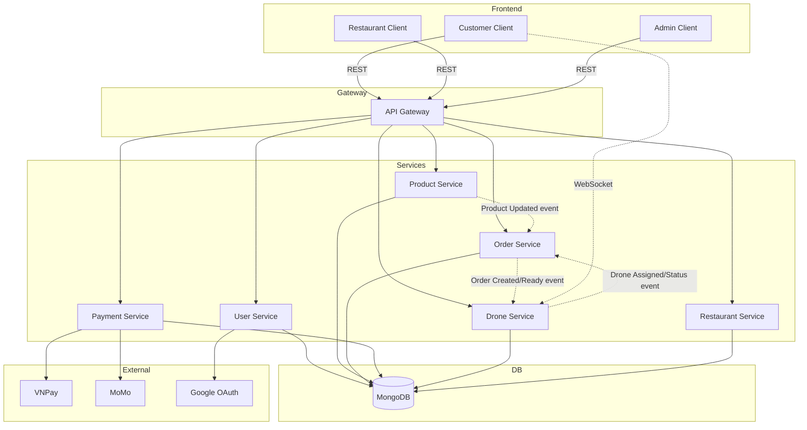

## Dịch vụ và vai trò

| Dịch vụ | Mục đích | Ghi chú |
| --- | --- | --- |
| API Gateway | Định tuyến tập trung, auth, rate limit, CORS | Cổng vào duy nhất cho tất cả client |
| User Service | Đăng nhập, hồ sơ, địa chỉ | JWT + Google OAuth (tùy chọn) |
| Product Service | Sản phẩm, danh mục, thương hiệu | Phát sự kiện Product Updated |
| Order Service | Đơn hàng, trạng thái, phân công | Lắng nghe Product Updated, kích hoạt gán drone |
| Payment Service | Thanh toán VNPay/MoMo | Xử lý callback và lịch sử giao dịch |
| Drone Service | Trạng thái, tracking, mô phỏng | Cập nhật WebSocket để theo dõi |
| Restaurant Service | Auth nhà hàng, hồ sơ, menu | API cho dashboard nhà hàng |

## Giao tiếp giữa các service

- Đồng bộ: REST qua API Gateway.
- Sự kiện: Product Updated -> Order; Order Created/Ready -> Drone; Drone Assigned/Status -> Order.
- Thời gian thực: Customer client kết nối Drone Service qua WebSocket để tracking.
- Thanh toán: Payment Service gọi VNPay/MoMo và xử lý callback.

## Các module frontend

- Customer Client: duyệt menu, đặt hàng, thanh toán, theo dõi drone.
- Restaurant Client: CRUD menu, xử lý đơn hàng, analytics.
- Admin Client: quản lý users, products, orders, payments, drones.

## Tính năng chính

- Auth, hồ sơ, quản lý địa chỉ
- Danh mục sản phẩm với categories/brands
- Vòng đời đơn hàng: pending -> confirmed -> preparing -> ready -> delivering -> completed
- Thanh toán qua VNPay (sandbox), MoMo (tùy chọn)
- Gán drone và theo dõi thời gian thực (mô phỏng)
- Admin và Restaurant dashboards

## Chức năng chi tiết

### 👤 Customer (Khách hàng)
- **Xác thực & Tài khoản**
  - Đăng ký/Đăng nhập (email, Google OAuth)
  - Quên/Reset mật khẩu
  - Quản lý hồ sơ (tên, avatar, điện thoại, ngày sinh, giới tính)
  - Quản lý múi địa chỉ (thêm, cập nhật, xóa, đặt mặc định)

- **Duyệt & Đặt hàng**
  - Duyệt danh sách nhà hàng theo vị trí hoặc tên
  - Xem chi tiết menu của từng nhà hàng
  - Tìm kiếm món ăn theo tên, category
  - Xem thông tin sản phẩm (giá, mô tả, hình ảnh, đánh giá)
  - Thêm/xóa món vào giỏ hàng
  - Đặt hàng từ nhiều nhà hàng (1 đơn hàng mỗi nhà hàng)

- **Thanh toán**
  - Chọn phương thức thanh toán (VNPay, MoMo, tiền mặt)
  - Nhập địa chỉ giao hàng
  - Áp dụng mã giảm giá/voucher
  - Xem chi tiết chi phí (thành tiền, phí giao, chiết khấu)
  - Thanh toán online hoặc COD

- **Quản lý đơn hàng**
  - Xem danh sách đơn hàng (lịch sử, đang chuyên chở, hoàn thành)
  - Xem chi tiết đơn hàng (sản phẩm, trạng thái, nhà hàng)
  - Cập nhật trạng thái đơn hàng
  - Hủy đơn hàng (nếu còn ở trạng thái cho phép)
  - Xem lịch sử thanh toán

- **Theo dõi giao hàng**
  - Xem vị trí drone real-time trên bản đồ (WebSocket)
  - Xem thông tin drone (ID, vị trí, thời gian ước tính)
  - Nhận thông báo khi drone đang trên đường
  - Xác nhận nhận hàng

- **Đánh giá & Review**
  - Đánh giá sản phẩm (sao, bình luận)
  - Đánh giá nhà hàng
  - Xem đánh giá từ users khác

### 🍴 Restaurant (Nhà hàng)
- **Xác thực & Hồ sơ**
  - Đăng ký/Đăng nhập nhà hàng
  - Quản lý thông tin nhà hàng (tên, địa chỉ, điện thoại, logo)
  - Cấu hình giờ mở cửa (theo từng ngày)
  - Tùy chọn thông báo

- **Quản lý Menu**
  - Thêm/xóa/sửa món ăn
  - Đặt giá, giảm giá (promotion)
  - Upload ảnh món ăn
  - Quản lý danh mục (categories)
  - Quản lý tồn kho (stock)

- **Quản lý Đơn hàng**
  - Xem danh sách đơn hàng mới/đang xử lý/hoàn thành
  - Xác nhận/Hủy đơn hàng
  - Cập nhật trạng thái (Preparing -> Ready -> Delivery -> Completed)
  - Xem chi tiết sản phẩm trong đơn
  - Quản lý thời gian chuẩn bị

- **Dashboard & Thống kê**
  - Tổng doanh thu (hôm nay, tuần, tháng)
  - Số lượng đơn hàng
  - Sản phẩm bán chạy nhất
  - Đánh giá trung bình
  - Biểu đồ phân tích

### 👨‍💼 Admin (Quản trị viên)
- **Quản lý Người dùng**
  - Xem danh sách tất cả users
  - Xem chi tiết user (tài khoản, địa chỉ, lịch sử đơn hàng)
  - Cập nhật thông tin user
  - Khóa/Mở khóa tài khoản
  - Xóa user

- **Quản lý Nhà hàng**
  - Xem danh sách nhà hàng
  - Xem chi tiết nhà hàng (thông tin, menu, đơn hàng)
  - Thêm/xóa nhà hàng
  - Bật/tắt trạng thái nhà hàng
  - Quản lý menu của nhà hàng

- **Quản lý Sản phẩm**
  - Xem tất cả sản phẩm của các nhà hàng
  - Thêm/xóa/cập nhật sản phẩm
  - Quản lý categories và brands
  - Giám sát tồn kho

- **Quản lý Đơn hàng**
  - Xem tất cả đơn hàng trong hệ thống
  - Lọc theo trạng thái, nhà hàng, thời gian
  - Xem chi tiết đơn hàng
  - Gán drone cho đơn hàng
  - Cập nhật trạng thái

- **Quản lý Thanh toán**
  - Xem tất cả giao dịch
  - Lọc theo phương thức, trạng thái
  - Xem chi tiết giao dịch
  - Xử lý refund/hoàn tiền

- **Quản lý Drone**
  - Xem danh sách drone
  - Xem chi tiết drone (ID, pin, trạng thái, vị trí)
  - Thêm/xóa drone
  - Theo dõi vị trí drone real-time
  - Xem lịch sử giao hàng của drone
  - Cập nhật trạng thái drone

- **Dashboard Tổng quát**
  - Thống kê tổng số users, nhà hàng, đơn hàng, drone
  - Doanh thu tổng hợp
  - Tỷ lệ đơn hàng hoàn thành
  - Hiệu suất drone
  - Biểu đồ phân tích theo thời gian

## Công nghệ sử dụng

### Frontend
- React 18, Vite
- React Router, React Query
- Tailwind CSS, React Hook Form
- Axios, Socket.io-client

### Backend
- Node.js, Express
- MongoDB, Mongoose
- JWT, bcrypt
- Socket.io (theo dõi drone)

### Tích hợp
- VNPay (sandbox), MoMo (tùy chọn)
- Google OAuth (tùy chọn)

## Chạy nhanh (script)

Windows:

```bash
./run-everything.ps1
```

Sau khi chạy xong:

- Frontend: http://localhost:5175
- API Gateway health: http://localhost:3000/health

Chi tiết script: xem [QUICK-START-ALL.md](QUICK-START-ALL.md).

## Chạy thủ công

Hướng dẫn setup thủ công, file .env mẫu và thứ tự chạy: [MANUAL-START.md](MANUAL-START.md).

## Seed dữ liệu

Script seed và các bước đồng bộ:

- [project/data_demo/README.md](project/data_demo/README.md)
- Thứ tự: seed restaurants -> seed products -> link products -> sync sang menu items

## Ghi chú cấu hình

- Mỗi service dùng .env riêng (PORT, DB_URL, JWT, service URLs).
- API Gateway proxy request theo service URLs.
- Frontend dùng VITE_API_BASE_URL để gọi gateway.

## Ports (kiểm tra .env để xác nhận)

Cấu hình local thường gặp trong scripts:

- API Gateway: 3000
- User: 3001
- Product: 3002
- Order: 3003
- Payment: 3004
- Frontend: 5175
- Payment Service 2 (VNPay sandbox): 3005

Một số tài liệu cũ đề cập port 400x (gateway 4000, services 4001+). Hãy ưu tiên .env và script khởi động.

## API Endpoints

### 👤 User
- GET /api/v1/users/me - Lấy thông tin user hiện tại
- PATCH /api/v1/users/updateMe - Cập nhật thông tin cá nhân
- PATCH /api/v1/users/updateMyPassword - Đổi mật khẩu
- GET /api/v1/users/me/address - Lấy danh sách địa chỉ
- PATCH /api/v1/users/createAddress - Thêm địa chỉ mới
- PATCH /api/v1/users/updateAddress - Cập nhật địa chỉ
- PATCH /api/v1/users/setDefaultAddress - Set địa chỉ mặc định
- GET /api/v1/users - Danh sách users (Admin)
- GET/PATCH/DELETE /api/v1/users/:id - Chi tiết/cập nhật/xóa user (Admin)

### 🔑 Authentication Routes (User Service)
- POST /api/v1/auth/logout - Đăng xuất
- GET /api/v1/auth/verify - Verify JWT token
- POST /api/v1/auth/forgotPassword - Quên mật khẩu
- PATCH /api/v1/auth/resetPassword/:token - Reset mật khẩu
- POST /api/v1/auth/googleLogin - Đăng nhập Google OAuth

### 📦 Product
- GET /api/v1/products - Danh sách sản phẩm (search, filter, pagination)
- GET /api/v1/products/top-5-cheap - Top 5 sản phẩm rẻ nhất
- GET /api/v1/products/:id - Chi tiết sản phẩm
- POST /api/v1/products - Tạo sản phẩm mới (Admin)
- PATCH /api/v1/products/:id - Cập nhật sản phẩm
- DELETE /api/v1/products/:id - Xóa sản phẩm
- GET /api/v1/categories - Danh sách categories
- POST /api/v1/categories - Tạo category (Admin)
- GET /api/v1/brands - Danh sách brands
- POST /api/v1/brands - Tạo brand (Admin)

### 🛒 Order
- GET /api/v1/orders - Danh sách đơn hàng của user
- POST /api/v1/orders - Tạo đơn hàng mới
- GET /api/v1/orders/:id - Chi tiết đơn hàng
- PATCH /api/v1/orders/:id - Cập nhật đơn hàng
- PATCH /api/v1/orders/:id/status - Cập nhật trạng thái đơn hàng
- GET /api/v1/orders/user/:userId - Danh sách đơn hàng của user (Admin)
- GET /api/v1/orders/restaurant/:restaurantId - Danh sách đơn hàng của nhà hàng
- GET /api/v1/orders/count - Đếm đơn hàng theo status
- GET /api/v1/orders/sum - Tổng doanh thu
- POST /api/v1/orders/topProduct - Top sản phẩm bán chạy

### 💳 Payment
- POST /api/v1/payments/create_payment_url - Tạo URL thanh toán VNPay
- POST /api/v1/payments/return_payment_status - Callback VNPay
- POST /api/v1/payments/stripe/create-payment-intent - Tạo Stripe payment intent
- POST /api/v1/payments/stripe/confirm-payment - Confirm Stripe payment
- POST /api/v1/payments/refund - Tạo refund
- GET /api/v1/payments/get-all-payments - Danh sách transactions
- GET /api/v1/payments/:id - Chi tiết transaction

### 🚁 Drone
- GET /api/v1/drones - Danh sách tất cả drones
- GET /api/v1/drones/available - Drones khả dụng
- GET /api/v1/drones/:id - Chi tiết drone
- GET /api/v1/drones/order/:orderId - Drone theo order
- POST /api/v1/drones/assign - Assign drone cho order
- PATCH /api/v1/drones/:id/status - Cập nhật status drone
- PATCH /api/v1/drones/:id/location - Cập nhật vị trí drone

### 🍴 Restaurant
- POST /api/restaurant/signup - Đăng ký nhà hàng
- POST /api/restaurant/login - Đăng nhập nhà hàng
- GET /api/restaurant/profile - Thông tin nhà hàng
- PUT /api/restaurant/profile - Cập nhật profile nhà hàng
- PUT /api/restaurant/business-hours - Cập nhật giờ mở cửa
- GET /api/restaurant/stats - Dashboard statistics
- GET /api/restaurant/orders - Danh sách đơn hàng nhà hàng
- GET /api/restaurant/menu - Danh sách menu items
- POST /api/restaurant/menu - Tạo menu item
- GET/PUT/DELETE /api/restaurant/menu/:id - Chi tiết/cập nhật/xóa menu item
- PATCH /api/restaurant/menu/:id/stock - Cập nhật stock

### ⚙️ Admin
- GET /api/v1/admin/users - Quản lý users
- GET /api/v1/admin/products - Quản lý products
- GET /api/v1/admin/orders - Quản lý orders
- GET /api/v1/admin/payments - Quản lý payments
- GET /health - Health check gateway

## Giao diện hệ thống

### 🏗️ Kiến trúc và Sơ đồ

<table align="center">
  <tr>
    <td align="center" width="50%">
      <br>
      <b>Giải pháp kiến trúc tổng thể</b>
    </td>
    <td align="center" width="50%">
      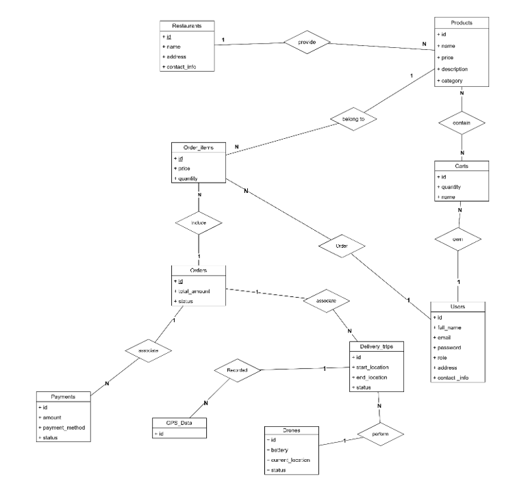<br>
      <b>Sơ đồ Entity Relationship Database</b>
    </td>
  </tr>
</table>

### 👥 Use Cases theo Vai trò

<table align="center">
  <tr>
    <td align="center" width="33%">
      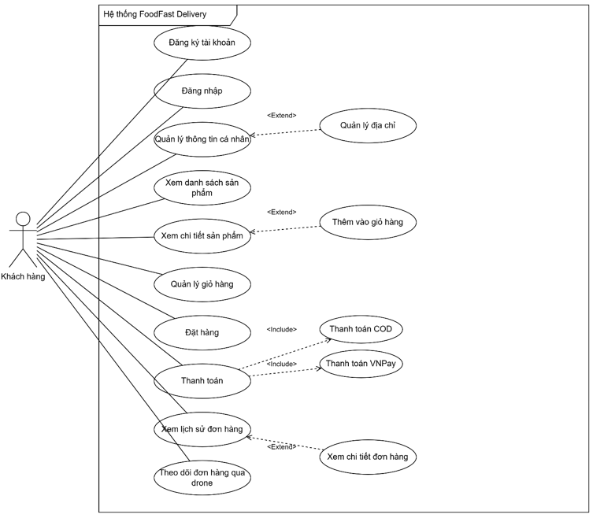<br>
      <b>Khách hàng (Customer)</b>
    </td>
    <td align="center" width="33%">
      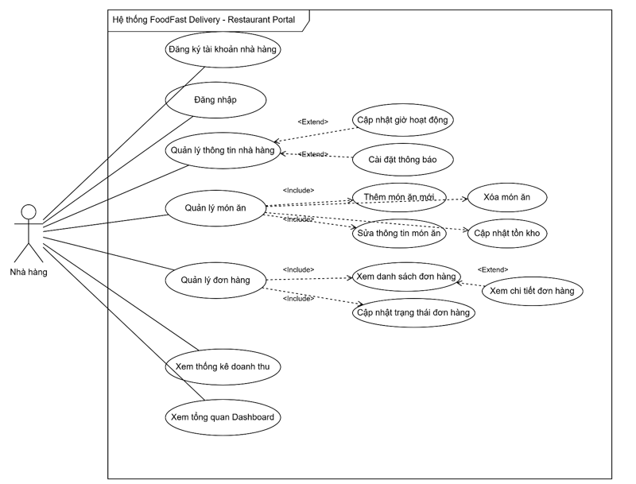<br>
      <b>Nhà hàng (Restaurant)</b>
    </td>
    <td align="center" width="33%">
      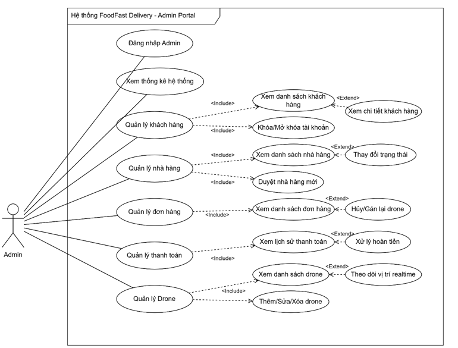<br>
      <b>Quản trị viên (Admin)</b>
    </td>
  </tr>
</table>

### 📊 Luồng hoạt động

<table align="center">
  <tr>
    <td align="center" width="33%">
      <br>
      <b>Luồng Khách hàng</b>
    </td>
    <td align="center" width="33%">
      <br>
      <b>Luồng Nhà hàng</b>
    </td>
    <td align="center" width="33%">
      <br>
      <b>Luồng Admin</b>
    </td>
  </tr>
</table>

### 👤 Giao diện Khách hàng (Customer App)

<table align="center">
  <tr>
    <td align="center" width="50%">
      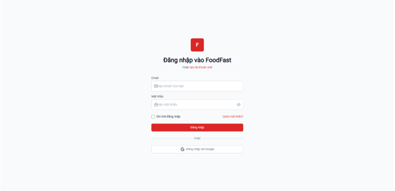<br>
      <b>1️⃣ Đăng nhập</b><br>
      Giao diện đăng nhập cho khách hàng
    </td>
    <td align="center" width="50%">
      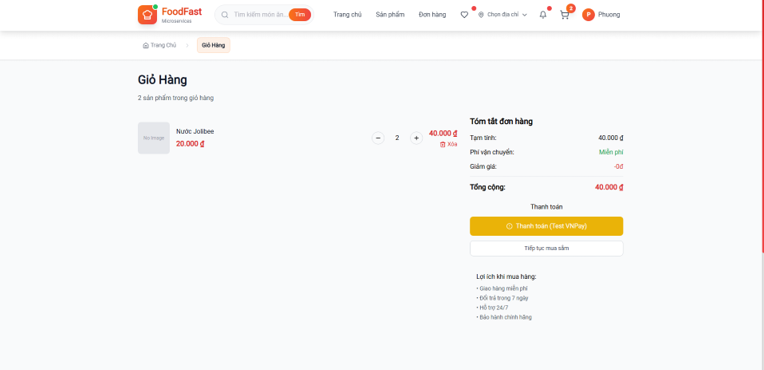<br>
      <b>2️⃣ Đặt hàng</b><br>
      Chọn món ăn, xem menu từ các nhà hàng
    </td>
  </tr>
  <tr>
    <td align="center" width="50%">
      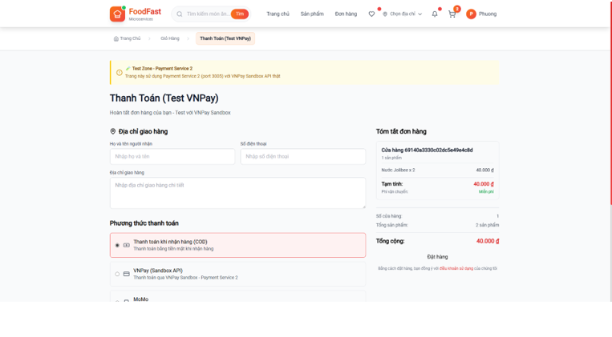<br>
      <b>3️⃣ Thanh toán</b><br>
      Tích hợp VNPay, MoMo cho thanh toán online
    </td>
    <td align="center" width="50%">
      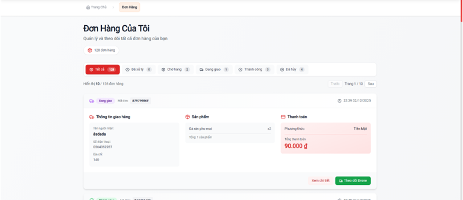<br>
      <b>4️⃣ Quản lý đơn hàng</b><br>
      Xem danh sách đơn hàng của mình
    </td>
  </tr>
</table>

<table align="center">
  <tr>
    <td align="center" width="100%">
      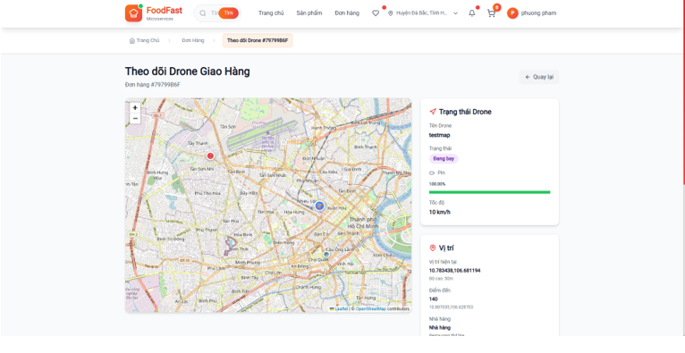<br>
      <b>5️⃣ Theo dõi Drone</b><br>
      Tracking vị trí drone theo thời gian thực trên bản đồ
    </td>
  </tr>
</table>

### 🍴 Giao diện Nhà hàng (Restaurant App)

<table align="center">
  <tr>
    <td align="center" width="50%">
      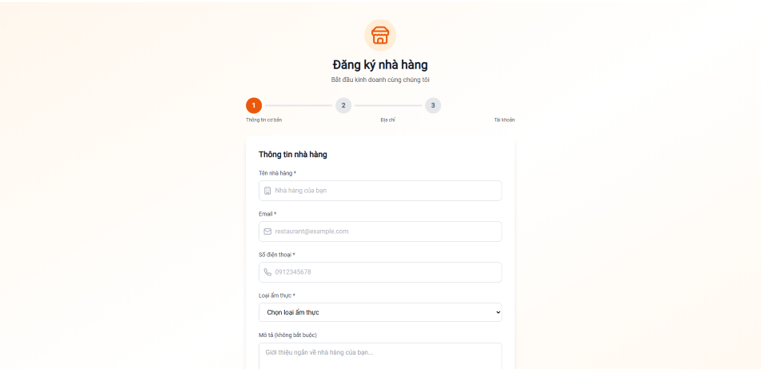<br>
      <b>1️⃣ Đăng nhập Nhà hàng</b><br>
      Xác thực tài khoản nhà hàng
    </td>
    <td align="center" width="50%">
      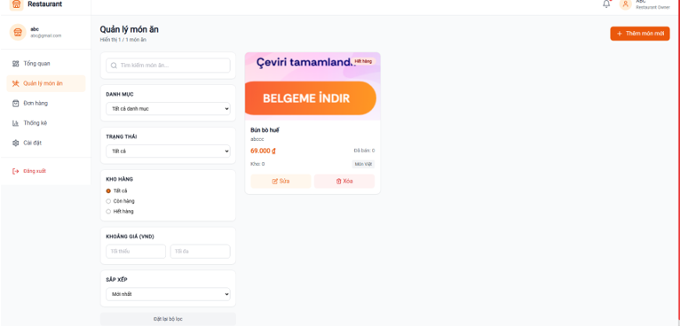<br>
      <b>2️⃣ Quản lý Món ăn</b><br>
      CRUD menu items, cập nhật tồn kho
    </td>
  </tr>
  <tr>
    <td align="center" width="50%">
      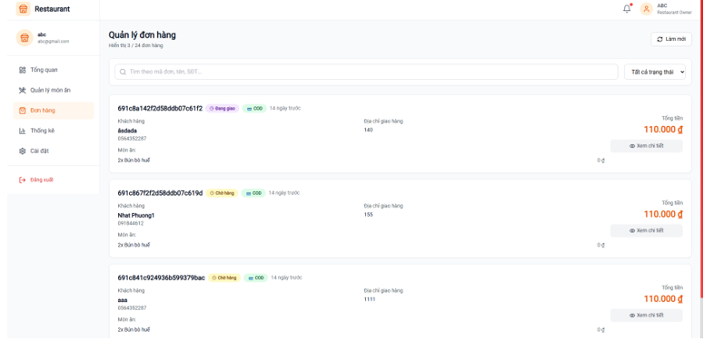<br>
      <b>3️⃣ Quản lý Đơn hàng</b><br>
      Xử lý đơn hàng, cập nhật trạng thái
    </td>
    <td align="center" width="50%">
      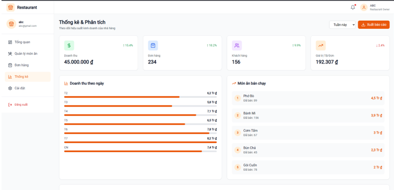<br>
      <b>4️⃣ Thống kê Doanh thu</b><br>
      Báo cáo doanh thu, phân tích bán hàng
    </td>
  </tr>
</table>

### 👨‍💼 Giao diện Admin (Admin Dashboard)

**Quản lý Người dùng:**

<table align="center">
  <tr>
    <td align="center" width="50%">
      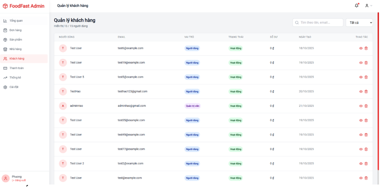<br>
      <b>1️⃣ Quản lý Người dùng</b><br>
      Danh sách, xem chi tiết thông tin
    </td>
    <td align="center" width="50%">
      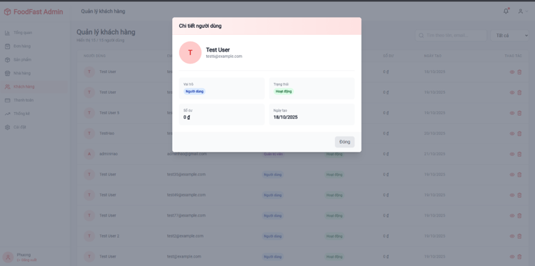<br>
      <b>2️⃣ Chi tiết Người dùng</b><br>
      Cập nhật, khóa/mở khóa tài khoản
    </td>
  </tr>
</table>

**Quản lý Đơn hàng:**

<table align="center">
  <tr>
    <td align="center" width="50%">
      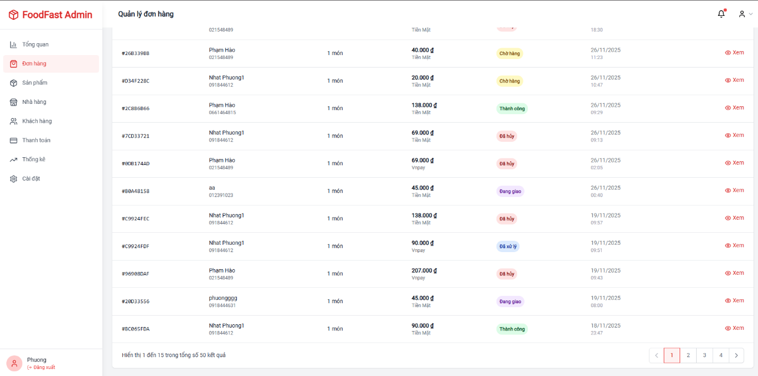<br>
      <b>3️⃣ Quản lý Đơn hàng</b><br>
      Danh sách đơn hàng hệ thống
    </td>
    <td align="center" width="50%">
      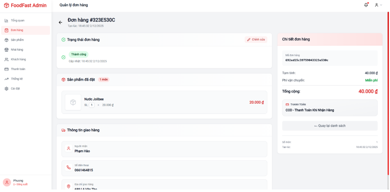<br>
      <b>4️⃣ Chi tiết Đơn hàng</b><br>
      Xem thông tin, gán drone, cập nhật trạng thái
    </td>
  </tr>
</table>

**Quản lý Drone:**

<table align="center">
  <tr>
    <td align="center" width="50%">
      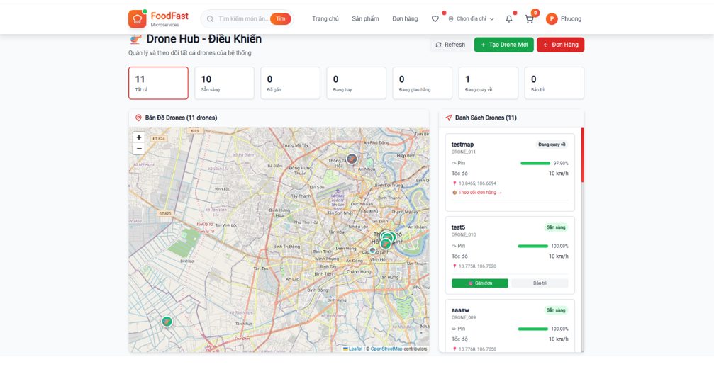<br>
      <b>5️⃣ Quản lý Drone</b><br>
      Danh sách drone, trạng thái sẵn sàng
    </td>
    <td align="center" width="50%">
      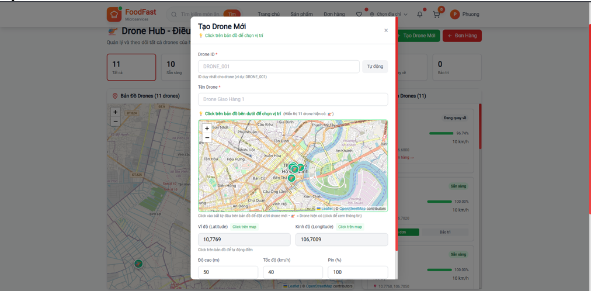<br>
      <b>6️⃣ Chi tiết Drone</b><br>
      Vị trí, pin, trạng thái hiện tại
    </td>
  </tr>
</table>

<table align="center">
  <tr>
    <td align="center" width="100%">
      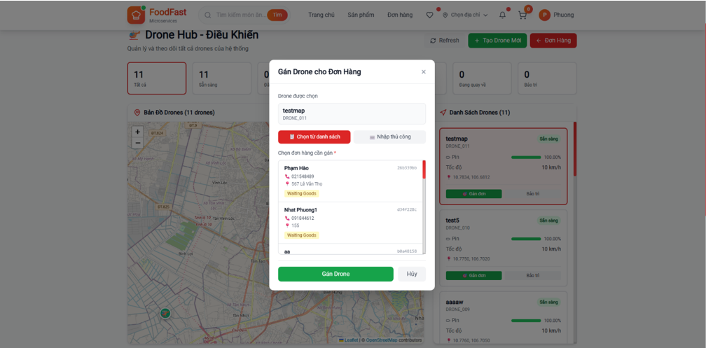<br>
      <b>7️⃣ Bản đồ Drone</b><br>
      Theo dõi vị trí drone trên bản đồ
    </td>
  </tr>
</table>

**Quản lý Nhà hàng & Thống kê:**

<table align="center">
  <tr>
    <td align="center" width="50%">
      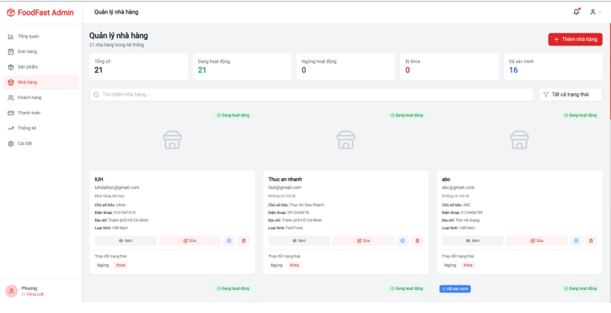<br>
      <b>8️⃣ Quản lý Nhà hàng</b><br>
      Danh sách, thông tin nhà hàng trong hệ thống
    </td>
    <td align="center" width="50%">
      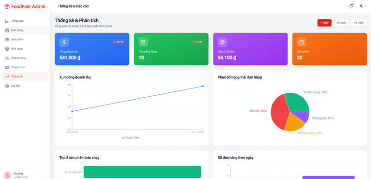<br>
      <b>9️⃣ Thống kê Hệ thống</b><br>
      Dashboard tổng quan, biểu đồ, metric quan trọng
    </td>
  </tr>
</table>